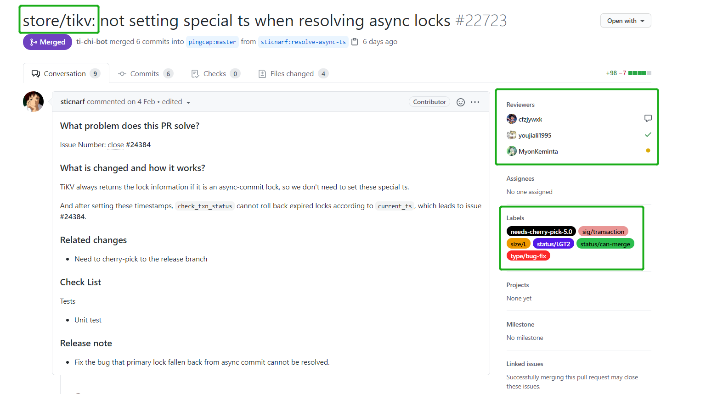
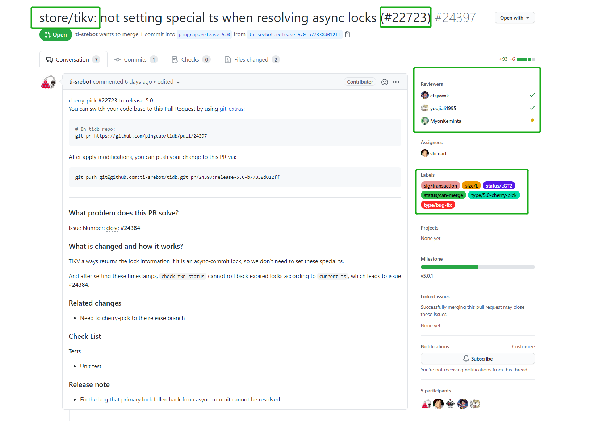

# 提交流程

## 示意图


## 准备工作

新建本地分支并切换。

```git
git checkout -b <分支名称>
```

针对要修改的内容在上游仓库新建 issue。

需注意如下规范：

- issue 标题开头应标注 issue 类型
- 根据模板尽可能详细地描述待提交的内容
- 添加 Assignees 和 Labels
- issue 解决后及时关闭

示例：

## 步骤

### 1. 将修改添加到缓存中

```git
git add <文件路径>
```

### 2. 提交修改并附加说明信息

```git
git commit -m "说明信息"
```

说明信息应注意如下规范：

- 说明信息开头需注明修改的文件/文件夹
- 说明信息结尾应附加对应的issue id

### 3. 同步上游仓库代码

```git
git fetch upstream <分支名称>
git rebase upstream <分支名称>
```

> git pull = git fetch + git merge，merge 会参产生额外的 commit，推荐使用 rebase 代替 merge。

### 4. 解决冲突

详细步骤参考 冲突处理（待更新）。

> 若无冲突可跳过此步骤。

### 5. 上传至远程仓库

如下指令将把本地的提交上传到与本地分支同名的远程分支，若此远程分支不存在会自动新建。

```git
git push origin <本地分支名称>
```

若远程分支已存在，可以使用如下指令创建新本地分支并关联远程分支。

```git
git branch --track <新分支名> <远程分支名>
```

```git
git push
```

### 6. 提交 Pull Request

提交 PR 申请将本地上传到远程仓库的分支合并到上游仓库的指定分支中。

需注意如下规范：

- 一个PR对应一个 issue
- 同类修改只保留一个 commit
- PR 标题开头应注明修改的文件/文件夹
- PR 标题结尾应附加相应 issue 的 id
- 按照模板尽可能详细的描述修改的内容。
- 添加 Reviewers 和 Labels
- 修改完问题后应将问题设置为已解决
- review 完成后由项目管理者选择合并

示例：


