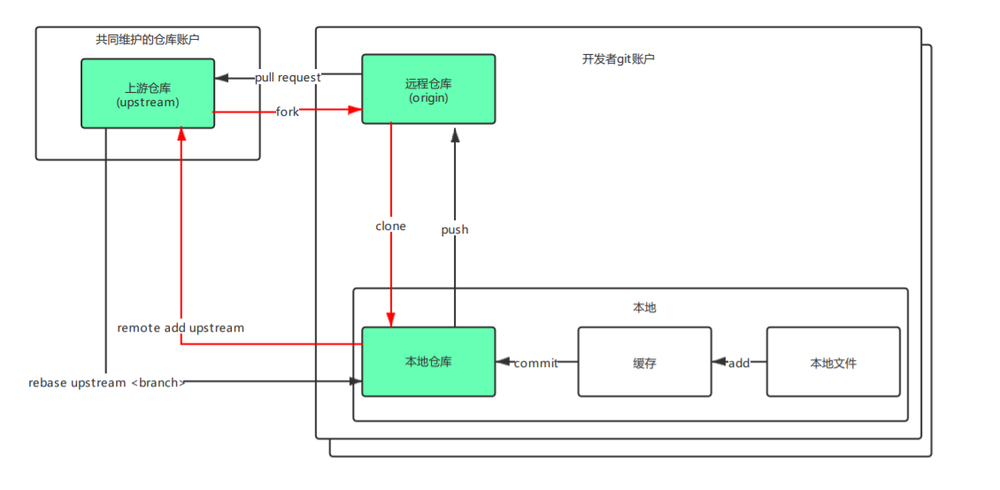

# 搭建 Git 环境

## 示意图



## 准备工作

### 配置 Git SSH

Git 可以通过 HTTPS 或 SSH 方式拉取代码，两种方式的区别如下：

- clone: 使用 ssh 方式时，必须是该项目的管理者或拥有者，并且需要配置个人的 ssh key。使用 https 方式不需要。

- push: 使用 ssh 方式时，不需要验证用户名和密码，如果在配置 ssh key 时设置了密码，则仅需要验证配对密码。而使用 https 方式，每次 push 都需要验证用户名和密码。

配置步骤可参考[Git SSH 配置](https://blog.csdn.net/lqlqlq007/article/details/78983879)。

## 步骤

### 1. 通过 web 端 Fork 上游仓库

### 2. 使用远程仓库链接将代码 clone 到本地

```git
git clone <远程仓库git链接>
```

### 3. 添加上游仓库

```git
git remote add upstream <上游仓库git链接> 
```

### 4. 拉取上游仓库分支

```git
git fetch upstream
```
